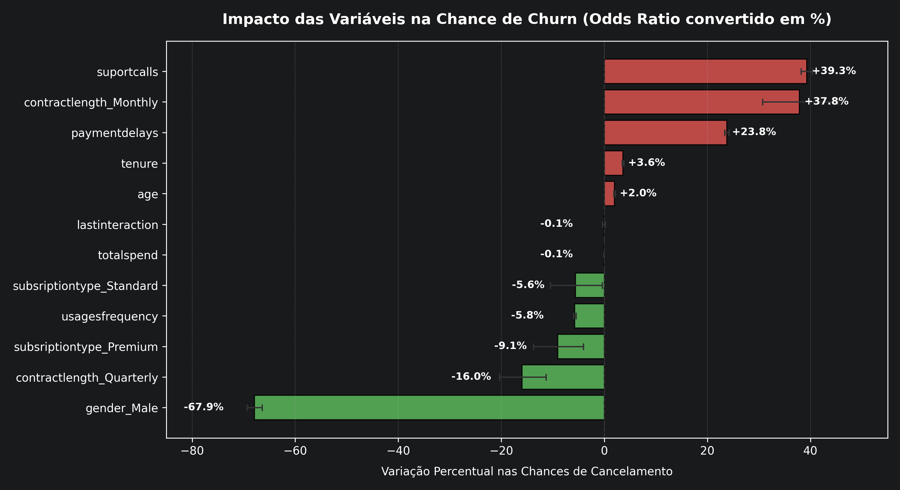

## 📈 Logistic Regression Model Analysis

### 📊 Model Goodness of Fit & Summary
*   **Solid Fit:** The **Pseudo R-squared (0.4321)** indicates that the model explains approximately 43.2% of the churn variability. For human behavior and retention datasets, this is considered a very strong value.
*   **Overall Significance:** The **LLR p-value (0.000)** proves that the model as a whole is highly reliable and stochastically superior to a baseline model with no predictors.

---

### 🔥 Key Churn Levers (Risk Factors)
These variables increase the likelihood of a customer canceling the service (positive coefficients with a $P > |z|$ lower than 0.05):

*   **Support Calls (`suportcalls` = +0.3313):** This is one of the strongest predictors of friction. Each additional call to customer support significantly drives up churn risk. This signals underlying issues with the product experience or customer service friction.
*   **Monthly Contract (`contractlength_Monthly` = +0.3209):** Customers on monthly plans display a drastically higher propensity to churn compared to the baseline category (Annual). The absence of a long-term commitment makes customer exit much easier.
*   **Payment Delays (`paymentdelays` = +0.2132):** Each additional day of payment delay clearly accelerates churn risk. Delinquency or financial constraints are powerful early warning signs of imminent abandonment.
*   **Tenure (`tenure` = +0.0354) & Age (`age` = +0.0195):** Interestingly, churn risk increases slightly as customers grow older and accumulate more time under contract.

---

### 🛡️ Retention Factors (Protective Factors)
These variables decrease the likelihood of a customer canceling the service (negative coefficients with a $P > |z|$ lower than 0.05):

*   **Male Gender (`gender_Male` = -1.1363):** This is the strongest negative coefficient. Men in this dataset have a significantly lower chance of churning compared to women.
*   **Usage Frequency (`usagesfrequency` = -0.0592):** The more frequently a customer utilizes the platform/service, the lower their risk of cancellation. High engagement successfully retains customers.
*   **Quarterly Contract (`contractlength_Quarterly` = -0.1741):** Compared to the Annual plan baseline, the Quarterly plan presents a lower risk of churn within this specific model.
*   **Premium and Standard Plans:** Both tiers successfully reduce churn compared to the *Basic* plan. The `Premium` plan (-0.0949) protects customer retention slightly better than the `Standard` plan (-0.0576).
*   **Total Spend (`totalspend` = -0.0010):** Customers who have historically invested more money have a marginally lower propensity to cancel (a subtle effect due to the variable's dollar scale, but statistically significant).

---

### ⚠️ Statistically Insignificant Variables
*   **Last Interaction (`lastinteraction` = -0.0010):** The $P > |z|$ value is 0.452 (well above the standard 0.05 threshold). This means that this variable **holds no statistical significance** in explaining churn within this model. The number of days since the last contact makes no difference to cancellation patterns here.

---

## 💡 Data-Driven Business Recommendations
*   **Support Interventions:** Set up automated triggers handled by the *Customer Success* team as soon as a customer reaches their 3rd or 4th support call to proactively resolve friction.
*   **Contract Migration:** Design targeted marketing campaigns and incentives to migrate monthly subscribers over to Quarterly or Annual plans.
*   **Billing Workflows:** Implement automated, friendly payment reminders prior to the due date to mitigate delinquency before it converts into churn.

---

### 📊 Impact Analysis (Odds Ratio in %)

The chart below quantifies the percentage change in churn odds for each one-unit change in the model's variables. **Red** bars represent factors that increase the risk of cancellation, while **green** bars represent protective and retention factors.

*   **Practical Interpretation:** Each new call to customer support (`suportcalls`) increases a customer's odds of cancellation by **39.3%**. Conversely, male customers (`gender_Male`) have a **67.9% lower** propensity to churn compared to female customers within this dataset.
